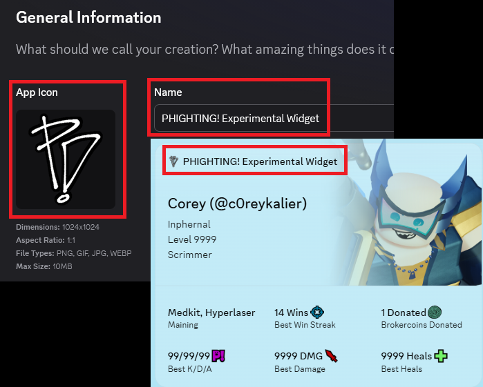

# Setting up your Discord Bot

This is where you can learn how to set up your bot and get it running on your machine (Or your local server)

## Prepare your bot

Before you can start using your bot, you'll need to set up several things on Discord and configure some files on your computer. Don't worry, this guide will walk you through each step carefully.

### Step 1: Configure your Application and get your Application ID

**What is this?** Every Discord bot is connected to an "Application." Think of this as the home base for your bot.
The name and icon you choose for your application will be displayed as your widget's name and icon to users.



**How to do it:**

1. Go to the [Discord Developer Portal](https://discord.com/developers/applications)
2. On the left sidebar, click **Overview** and then select **General Information**
3. On this page, you can:
   - Change your application's name (this is what users will see)
   - Upload a custom icon/image for your application
4. Look for the **Application ID** - it's a long string of numbers on this same page
5. Click the "Copy" button next to your Application ID
6. Open the `.env` file on your computer and paste this ID next to `APPLICATION_ID`

### Step 2: Set up your Redirect URL

**What is this?** A redirect URL tells Discord where to send users after they authorize your app. This is necessary for the login process to work properly.

**How to do it:**

1. In the left sidebar, click **OAuth2** (it should be under **Overview**)
2. Click on **Redirects** or look for a section to add redirect URLs
3. Click "Add Redirect" and enter: `https://discord.com`
4. Click "Save"

This allows Discord to authorize your app with your account without errors.

### Step 3: Get your Bot Token

**How to do it:**

1. In the left sidebar, click **Bot** (under **Overview**)
2. Under the "Bot Token" section, click "Reset Token"
3. If Discord asks you to verify with 2FA (Two-Factor Authentication), complete that process
4. Discord will show your token EXACTLY ONCE. Copy it.
5. Open your `.env` file and paste the token next to `BOT_TOKEN`

### Step 4: Add Bloxlink and get the API Key

**What is this?** Bloxlink is a service that helps connect Discord accounts to Roblox accounts. To get your Roblox username from your Discord account, we need to use Bloxlink's API.

**How to do it:**

1. First, invite Bloxlink to your Discord server.
2. Visit [Bloxlink's Developer API page](https://bloxlink.dev/dashboard)
3. Log in with your Discord account
4. Add your Discord server to the list
5. Once added, click the "See Key" button to reveal your server key
6. Copy this key and paste it into your `.env` file next to `BLOXLINK_API_KEY`

### Step 5: Install the necessary modules

**What is this?** Modules (also called "packages" or "libraries") are pre-written code that helps your bot function. You need to download them to your computer before running the bot.

**How to do it:**

1. On your computer, open your command interpreter:
   - **Windows**: Open Command Prompt (search for "cmd" in the Start menu)
   - **Mac**: Open Terminal (search for "terminal" in your search bar)
   - **Linux**: Open your terminal application (If you are using this, I believe that you know what you are doing anyways)
2. Head over to the directory/folder of the bot and type the following command and press Enter:

```bash
npm install
```

3. Wait for the installation to complete. You should see messages about downloading and installing packages

Once all steps are complete, your bot is ready to go!

## Running the bot

In the same command window, you need to run two commands. Follow these steps carefully:

### First command - Tell Discord about your commands

Copy and paste this command into your command window, then press Enter:

```bash
npm run deploy
```

**What's happening:** This command tells Discord about all the commands your bot can do. Wait for it to finish - you'll see some messages appear. This usually takes a few seconds.

### Second command - Start your bot

Once the first command is done, copy and paste this command and press Enter:

```bash
npm start
```

**Congratulations!** Your bot is now running and ready to use.

⚠️ **Important for Windows users:** Do NOT close this command window while your bot is running. If you close it, your bot will stop working. Keep it open the entire time you want your bot to be active. You can minimize it if you want it out of the way. Only close it when you're completely done and want to turn the bot off.