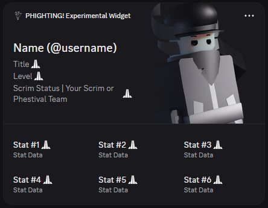
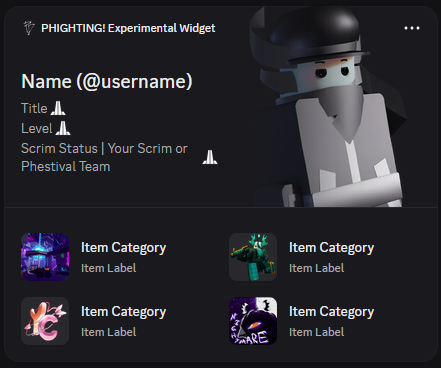

# Setting up your Discord Widget

This is where you will learn how to set up your widget. It is highly recommended to set up using a pre-set template in this repo, if you are also planning to use the bot in this repo to edit your data.

---

## Widget Templates

In this repository, you should see multiple widget templates for you to choose to import. You can only choose one to import per application. If you want to have multiple styles, you have to make multiple widgets.

### Style: Featured Stats

### Style: Featured Stats (Alternative Layout)

> Although the layout looks the same, the Stat label and its Stat Data are swapped.

### Style: Featured Items (Not implemented to the bot yet!)

---

## Creating the Widget

### (Recommended) Importing automatically via Discord Widgets Extension

1. Download or clone https://github.com/TheCreativeGod/Discord-Widgets-Extension
2. **Chrome / Edge / Brave**: `chrome://extensions` → Enable Developer Mode → Load unpacked → select the `chrome-extension/` folder
3. **Firefox**: `about:debugging#/runtime/this-firefox` → Load Temporary Add-on → select `firefox-extension/manifest.json`

#### Import the widget layout and configure redirect

1. Go to https://discord.com/developers/applications and reload the page once after installing the extension
2. Click the **Widget Creator** button in the bottom-right corner
3. Paste the full contents of the json file of your choosing from this repo's `widget-template` folder into the JSON box
4. Click **Import** — the extension creates the application with the template layout and stat icons pre-configured
5. Complete any captcha / 2FA if prompted
6. Head back to your Discord, go to **Settings** → Authorized Apps and check if your new application (should usually be named "My New Widget") appears in it. If it does, de-authorize the app. We will be re-authorizing the application later when we set up the bot.

> **Note:** After importing, all data fields will appear **empty** — this is expected. The bot hasn't pushed any stats yet. Click the **pencil icon** on each data field to confirm the mapping is correct.
>
> 
> There are 2 fallback images: `zuka_fallback` and `sword` are uploaded automatically on import — `zuka_fallback` serves as a fallback image when there are no images available, while `sword` is for the preview for the widget when you add it from the "Add Widgets" menu.

Once done, head to the **Developer Portal** → OAuth2 page and add a redirect "https://discord.com". This will allow you to be able to authorize the app to your account.

After confirming the redirect URL has been set to "https://discord.com", get your bot token in the same **Developer Portal page**:

- **Application ID** → General Information page
- **Bot Token** → Bot page → Reset Token