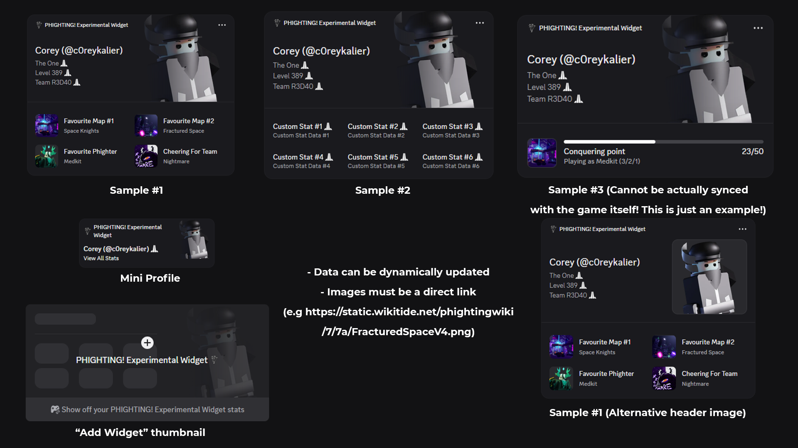

# Widget Templates

In this repository, you should see multiple widget templates for you to choose to import. You can only choose one to import per application. If you want to have multiple styles, you have to make multiple widgets.

## Style: Featured Stats

## Style: Featured Stats (Alternative Layout)

> Although the layout looks the same, the Stat label and its Stat Data are swapped.

## Style: Featured Items (Not implemented to the bot yet!)

## (Advanced) All styles provided by Discord

